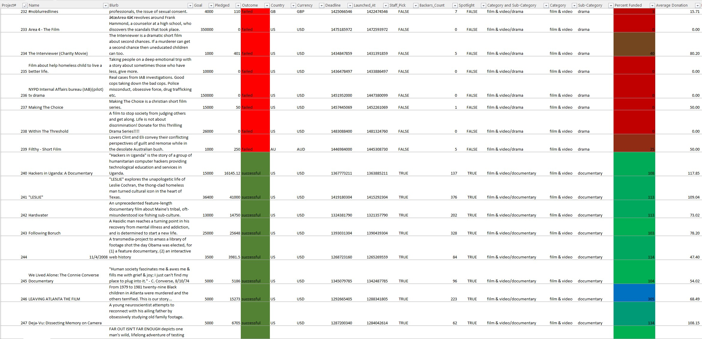
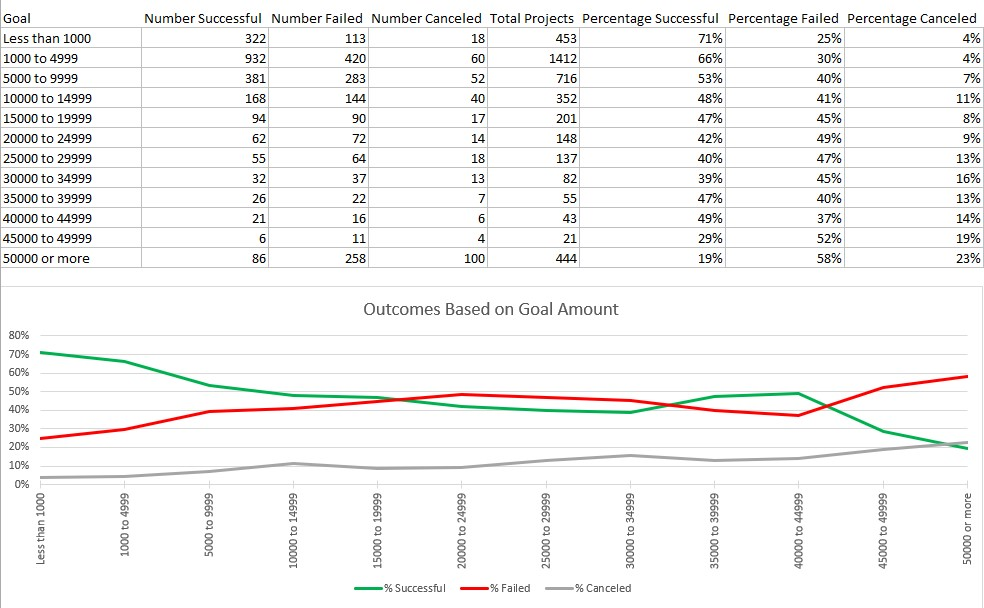
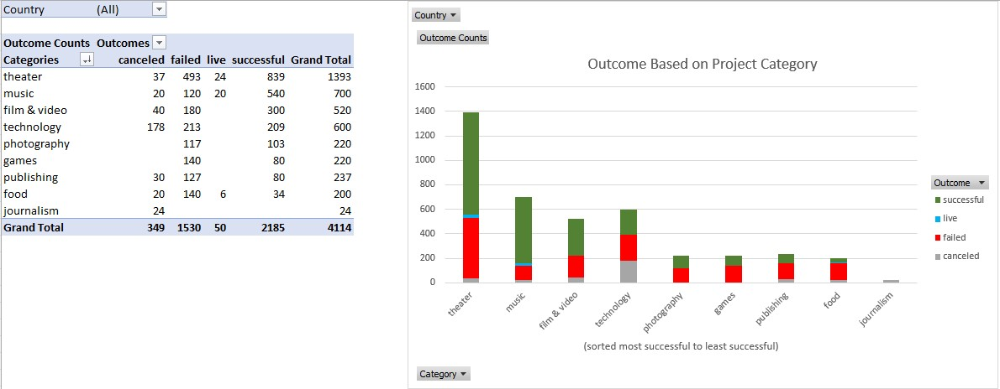

<h1> What determines Kickstarter success?   (Basic Excel and Pivot Table Demonstration) </h1>

#### Overview:
This small project is a quick demonstration of how to use some basic tools within Excel to analyze small to
medium sized datasets.  Data was provided from Kickstarter in the form of an Excel spreadsheet concerning
many of the projects that utilized their crowd funding platform and wether or not they were successful.
Some of the Excel tools utilized include Cell Formulas, 3-D Formula References, Tables, Conditional Formatting, Pivot Tables, and Pivot Charts.
Also, the concept of data binning is explored.

#### Feel Free to Examine These Files:
* "Kickstarter-Analysis.xlsx" (my analysis of Kickstarter success using an Excel dataset)
* "Kickstarter Analysis.docx" (my thoughts and conclusion about the dataset)

   

#### Example of Conditional Formatting:
  

#### Example of Binning:
  

#### Example of Pivot Table / Pivot Chart:
  
